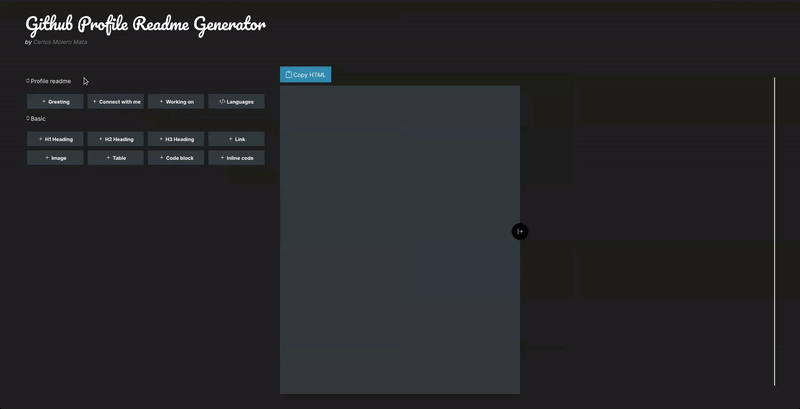

# GH Profile Readme Generator

A very simple project that I used to learn Angular. It is basically a markdown editor that allows you to see the result in real time. You can also select frequent content blocks to create a Github profile readme.

## Blocks

- Profile readme
  - Greeting
  - Connect with me
  - Working on
  - Languages
- Basic
  - H1 Heading
  - H2 Heading
  - H3 Heading
  - Link
  - Image
  - Table
  - Code block
  - Inline code

## Usage

Add blocks or write your content by hand, then click the 'Copy HTML' button to copy the HTML content to the clipboard. The markdown used by the editor has some incompatibilities with the Github flavored markdown, this is why is better to use the plain HTML result.

## Demo

## Contributing

PR's are welcome, feel free to add more blocks, languages or whatever functionality you think this app is missing.
